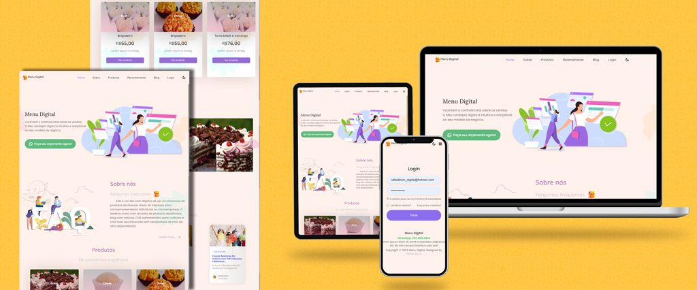
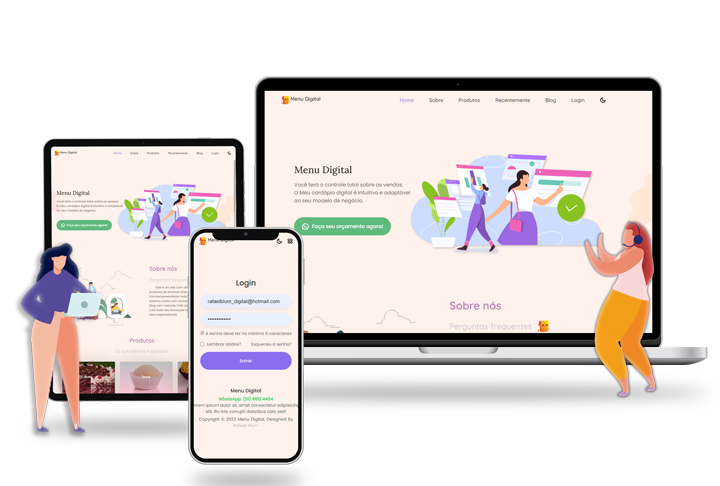

	

 

Menu Digital - <a href="https://www.cardapio-digital.online">https://www.cardapio-digital.online</a>

	
    
    
	

 

## planejamento do sistema [`Menu Digital`](https://menu-digital.online/)
Aqui vai o checklist das etapas de planejamento para o desenvolvimento do sistema web.
##### Ideação
- sobre
- Requisitos de software

##### Prototipagem
- Diagrama Entidade-Relacionamento (DER)

##### Detalhes técnicos
- Definir arquitetura do projeto
- Definir tecnologias (serviços externos, libs, frameworks, hospedagem etc.)

## Ideação

A ideia deste projeto de forma simples é que na pandemia e pós pandemia, muitas pessoas como microempreendedores individuais 
ou microempresas tiveram suas rendas zeradas ou muito diminuida, então muitos foram para o mercado informal, vendendo seus trabalhos
e negocios no boca a boca e via apps como WhatsApp, redes sociais, etc. E é neste ponto que pensei em criar este projeto,
para poder ajudar estas pessoas a inflar seu negocio, mostrando todos seus serviços e produtos de um jetio simples e moderno.

[`Menu Digital`](https://menu-digital.online/) é um `site moderno, responsivo e gerenciável`, com objetivo de ser um `menu demonstrativo` 
de produtos ou serviços, como um catálogo. O site também terá um blog para informar seus clientes com postagens informativas 
que podem ser totalmente formatadas do seu jeito. As formas de contatos que os usuários poderão realizar, 
serão via WhatsApp e cadastro por e-mail para recebimento de newslatters.

O site terá um CMS, Sistema de Gestão de Conteúdos, de forma bem direta, o CMS permitirá que você crie, organize, publique, 
configure e apague conteúdos do site. O grande diferencial do CMS, como o próprio nome diz, é a possibilidade de gerenciar 
conteúdo dinâmico de forma simples, ou seja, manter um blog, loja virtual ou outro tipo de site que precisa ser atualizado 
de forma constante. Então o CMS é a solução ideal para todo mundo que precisa de um site que não seja 100% estático e momentâneo.

O gerenciamento do sistema terá uma dashboard responsiva com painel rápido para verificação dos conteúdos e controle de 
tráfego, com a listagem de toda navegação dos usuários logados e anônimos.

A dashboard terá o gerenciamento das configurações do site, como nome, sobre e outros detalhes, páginas para gerenciamento de 
usuários, produtos, blog, todo FAQ e inscrições via e-mail.

##### Os requisitos funcionais (RF) referem-se sobre o que o sistema deve fazer, ou seja, suas funções e informações.
- [RF001] O Sistema deve autenticar o usuário administrador.
- [RF002] O Sistema deve ter uma dashboard administrativa com menu das funcionalidades.
- [RF003] O Sistema deve ter estatiscas trávego de navegação.
- [RF004] O Sistema deve ter administração de perguntas frequentes.
- [RF005] O Sistema deve ter administração de produtos com CRUD.
- [RF006] O Sistema deve ter administração de categorias com CRUD.
- [RF007] O Sistema deve ter administração do blog com CRUD.
- [RF008] O Sistema deve permitir a pesquisa de usuários, produtos e posts.
- [RF009] O Sistema deve ter paginação nas listagens.
- [RF010] O Sistema deve ter administração de configurações do site.
- [RF011] O Sistema deve ter somente um registro de configuração.
- [RF012] O Sistema não pode permitir deletar o registro de configuração.
- [RF013] O Sistema deve permitir ocultar o valor dos produtos.
- [RF014] O Sistema deve permitir registro de e-mail de usuário.
- [RF015] O Sistema deve permitir a administração da listagem do e-mails registrado.
- [RF016] O Sistema deve permitir mudar o status de e-mail registrado.
- [RF017] O Sistema deve permitir contato dos usuário via WhatsApp.

###### requisitos não funcionais (RNF) definem propriedades e restrições do sistema como tempo, espaço, linguagens de programação, versões do compilador, SGBD, Sistema Operacional, método de desenvolvimento, etc.
- [RNF001] O sistema deve ser implementado em Php.
- [RNF002] O sistema deve utiilizar o banco de dados MySql.
- [RNF002] O sistema será implementado na arquitetura MVC.
- [RNF003] O sistema deve utilizar Jquery.
- [RNF004] O sistema deve ser implementado utilizando componentes para melhor agilidade de desenvolvimento.
- [RNF005] O site deve ser 100% responsivo.
- [RNF006] O site deve ter segurança contra ataques.

## Prototipagem

A etapa de front end no projeto é uma etapa que estou me desenvolvendo e me atualizando cada vez mais, buscando as melhores praticas de estilização,
codifificação e sempre buscando desafios, com tecnologias novas. 
E neste projeto foi realizado uma pesquisa para se colocar o melhor layout, e personalização para uma experiencia de interface moderna, prática para usuários.

	

- Diagrama Entidade-Relacionamento (DER)

> O diagrama de classes é a representação estática utilizada para descrever a estrutura do sistema, apresentando as classes, atributos, operações e as relações entre os objetos.

    <h4>Diagrama de classes</h4>
    

O diagrama de classes do projeto, foi realizado no software  [`StarUML`](https://staruml.io/).

## Detalhes técnicos
######  Arquitetura do projeto
Para a organização de código do projeto, foi utilizada a arquitetura padrão MVC. Uma arquitetura muito conhecida `MVC (Model-View-Controller)` para aplicações web.

######  Tecnologias (serviços externos, libs, frameworks, hospedagem etc.)

- <a href="#" target="_blank">Linguagem utilizada Php `8.2`</a>
- <a href="#" target="_blank">Composer `2.5.1`</a>
- <a href="#" target="_blank">Hospedagem Compartilhada</a>
- <a href="#" target="_blank">Git `2.37.1`</a>
- <a href="#" target="_blank">fakerphp/faker `v1.21.0`</a>
- <a href="#" target="_blank">league/plates `3.*`</a>
- <a href="#" target="_blank">league/csv `9.3.*`</a>
- <a href="#" target="_blank">dompdf/dompdf `2.0.*`</a>
- <a href="#" target="_blank">matthiasmullie/minify `1.3.70`</a>
- <a href="#" target="_blank">phpmailer/phpmailer `6.5.0`</a>
- <a href="#" target="_blank">symfony/var-dumper `5.4.x-dev`</a>
- <a href="#" target="_blank">coffeecode/datalayer `2.0.7`</a>
- <a href="#" target="_blank">coffeecode/router `1.0.*`</a>
- <a href="#" target="_blank">coffeecode/paginator `1.0.*`</a>
- <a href="#" target="_blank">coffeecode/cropper `2.0.4`</a>
- <a href="#" target="_blank">coffeecode/optimizer `2.1.1`</a>
- <a href="#" target="_blank">coffeecode/uploader `2.0.4`</a>
- <a href="#" target="_blank">HTML</a>
- <a href="#" target="_blank">CSS</a>
- <a href="#" target="_blank">GitHub</a>
- <a href="#" target="_blank">Google Fonts</a>
- <a href="#" target="_blank">ScrollReveal `v4.0.9`</a>
- <a href="#" target="_blank">highcharts `v6.2.0`</a>
- <a href="#" target="_blank">jquery.form `3.51.0`</a>
- <a href="#" target="_blank">jquery.mask `v1.14.15`</a>
- <a href="#" target="_blank">jquery `v3.3.1`</a>
- <a href="#" target="_blank">jquery-ui `v1.12.1`</a>
- <a href="#" target="_blank">tinymce `3.1.1`</a>
- <a href="#" target="_blank">Remixicon `2.5.0`</a> 

## Contatos

**🔎 Acesse o site agora [`Menu digital`](https://menu-digital.online/)**
- Contatos 👇🏼 [rafaelblum_digital@hotmail.com]
- Contatos 👇🏼 [menu-digital@menu-digital.online]

 <em><b>Adoro me conectar com pessoas diferentes,</b> então se você quiser dizer <b>oi, ficarei feliz em conhecê-lo mais!</b> :)</em>